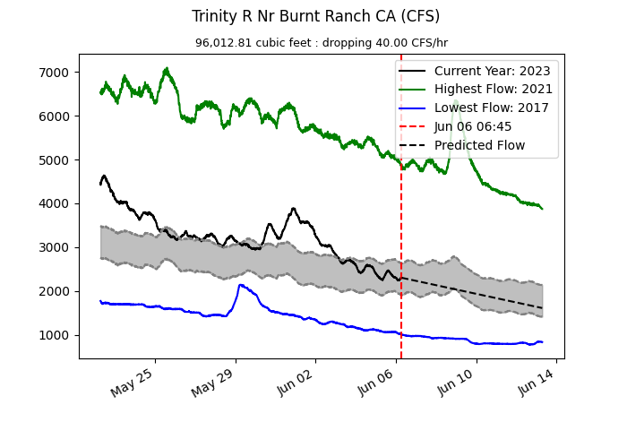

    <h1 align="center"> FlowForecast </h1>
    <h3 align="center"> A python application to predict river flow </h3> 

  <h3 align="center">Libraries used:</h3>
  
      

         
         
         
         
      

  

 
 
 
 

<h1 align="center"> Features: </h1>
<ul>
    <li>
        
Real-time data collection thanks to the hydrofunctions library!

    </li>
    <li>
        
Data caching to reduce on load times for repeated queries!

    </li>
    <li>
        
Saving your graphs as images to store them for later!

    </li>
    <li>
        
A quick-and-easy setup that only requires one python command!
    </li>
</ul>
 
 
 

<h1 align="center"> Example Graph: </h1>

    

 
 
 
 
<h1 align="center"> Planned Features:</h1>
<ul>
    <li>
        
 Cleaner & more intuitive UI 

    </li>
    <li>
        
 Loading text and faster data fetching 

    </li>
</ul>